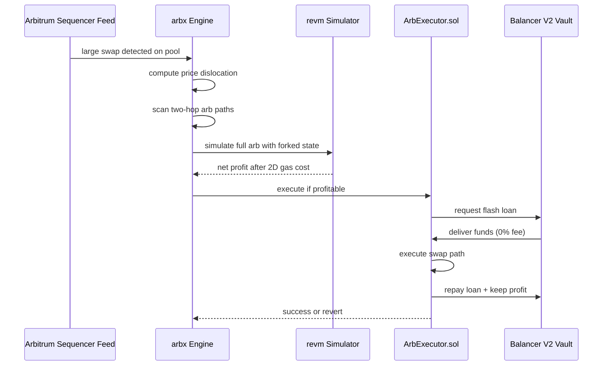
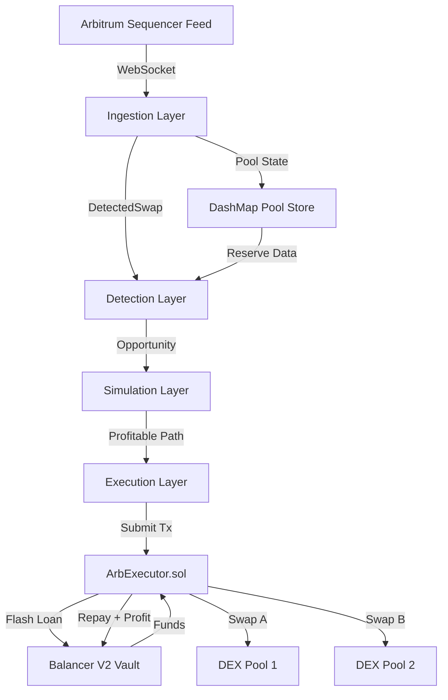

# arbx

`arbx` is a production-focused flash-loan arbitrage engine for Arbitrum, built in Rust and Solidity. It watches live market activity, finds short-lived price gaps between DEXes, simulates the full trade before spending gas, and only submits when the numbers still work.

It is designed to be readable by contributors, credible to employers, and safe enough to operate on a very small budget.

## What is arbx

`arbx` is a trading bot that borrows money for a single transaction, trades across two exchanges, repays the loan immediately, and keeps the profit if one exists.

The important part is that the loan, the trades, and the repayment all happen together. If the final profit is not there, the whole transaction cancels automatically. The bot does not get stuck holding assets. The main thing it can lose on a bad attempt is a small gas fee.

In plain English, the bot does this:

1. Notice that one market is selling an asset cheaper than another.
2. Borrow funds for a moment.
3. Buy low on one market.
4. Sell high on another market.
5. Repay the borrowed funds.
6. Keep the leftover difference as profit.

## How it Works



The full cycle is short:

1. The engine watches Arbitrum for newly ordered swaps.
2. It updates its view of pool prices.
3. It checks whether a two-hop round trip could end with more of the starting asset than it began with.
4. It simulates the whole trade locally with current chain state.
5. It includes Arbitrum's real gas cost model, not just the basic estimate.
6. It submits only if the simulated outcome is still profitable.

## Architecture



The system is split into three layers:

- Ingestion reads market activity and keeps local pool state fresh.
- Detection looks for candidate opportunities and estimates whether they are worth simulating.
- Execution simulates, submits, tracks PnL, and stops the system if the budget gets too low.

## Benchmark Results

| Benchmark | Result | Target | Improvement |
|---|---:|---:|---:|
| AMM price calculation | 17ns | 1000ns | 58x faster |
| Profit threshold check | 21ns | 10000ns | 476x faster |
| Calldata encoding | 133ns | 100000ns | 750x faster |
| Full market scan (100 pools) | 467us | 1000us | 2x faster |
| Pool state lookup | 51ns | 100ns | 2x faster |

If you do not work with performance numbers every day, these times are very small. A nanosecond is one billionth of a second. Even the slowest hot path in the table, a full 100-pool scan, finishes in less than half a millisecond. That matters because MEV systems compete on reaction time.

For comparison, quoting through the Uniswap v3 TypeScript SDK often lands in the 200,000ns to 500,000ns range per quote, depending on context. `arbx` keeps its hottest paths far below that by doing the core math in Rust and keeping most checks in memory.

## Test Coverage

The project is heavily tested because a trading system that is fast but wrong is still dangerous. The suite mixes unit tests, property tests, fork tests, chaos tests, and integration tests so the code is checked from several directions.

| Test Type | Count | What it proves |
|---|---:|---|
| Fork tests | 23 | Correct behavior against real Arbitrum state |
| Fuzz tests | 3 | No edge case breaks profit enforcement |
| Invariant tests | 3 | Core guarantees hold under arbitrary inputs |
| Property tests | 30+ | All formulas correct across 10,000 iterations |
| Chaos tests | 9 | System recovers from network failures cleanly |
| Unit tests | 186 | Every component works in isolation |

This means the code is not only tested for happy paths. It is also tested for malformed inputs, race conditions, reconnect behavior, and budget shutdown behavior.

## Supported DEXes

- **Uniswap V3**: Concentrated-liquidity pools, deeper liquidity, more complex pricing.
- **Camelot V2**: Arbitrum-native constant-product pools, simple and practical for early opportunities.
- **SushiSwap**: Familiar V2-style pools, useful for mid-tier pair coverage.
- **Trader Joe V1**: Another V2-style venue that adds more cross-DEX route combinations.

## Tech Stack

| Component | Technology | Purpose |
|---|---|---|
| Core engine | Rust | Main runtime, orchestration, math, safety logic |
| Smart contract | Solidity, Foundry | On-chain flash-loan execution and swap routing |
| Ethereum interaction | alloy-rs | RPC calls, address types, calldata encoding, signing |
| Simulation | revm | Local full-transaction simulation against forked state |
| Async runtime | Tokio | Concurrent task scheduling and channel-based pipeline |
| Feed parsing | sequencer_client | Arbitrum sequencer feed decoding and reconnect support |
| State store | DashMap | Concurrent in-memory pool state without a global mutex |
| Metrics | Prometheus client | Funnel tracking, PnL visibility, operational monitoring |
| Logging | tracing, tracing-subscriber | Structured logs for debugging and operations |
| Testing | cargo test, proptest, mockall, Foundry | Unit, property, integration, chaos, and fork testing |
| Benchmarking | Criterion | Hot-path latency measurement and regression tracking |

## Project Structure

```text
arbx/
├── benches/
│   └── hot_paths.rs              # Criterion benchmarks for critical hot paths
├── bin/
│   └── arbx.rs                   # Main binary, wires the whole runtime together
├── config/
│   ├── anvil_fork.toml           # Local mainnet-fork validation config
│   ├── default.toml              # Default production-style config template
│   ├── mainnet.toml              # Mainnet launch config with strict budget limits
│   └── sepolia.toml              # Arbitrum Sepolia config
├── contracts/
│   ├── script/                   # Foundry deploy and verify scripts
│   ├── src/                      # ArbExecutor.sol and contract code
│   └── test/                     # Solidity and fork tests
├── crates/
│   ├── common/                   # Shared types, config, metrics, PnL tracking
│   ├── detector/                 # Path scanning and profit threshold logic
│   ├── executor/                 # Submission logic and revert handling
│   ├── ingestion/                # Sequencer feed, pool seeding, reconciliation
│   └── simulator/                # revm-based full trade simulation
├── docs/
│   ├── ROADMAP.md                # Phase-by-phase execution plan
│   ├── SSOT.md                   # Single source of truth for architecture and status
│   └── *.md                      # Runbooks, deep docs, and primers
├── scripts/
│   └── *.sh                      # Deploy, run, smoke-test, and reporting helpers
└── tests/
	├── chaos/                    # Network and infrastructure fault injection tests
	├── integration/              # Full pipeline integration tests
	└── property/                 # Large property-based test suite
```

## Getting Started

### 1. Prerequisites

```bash
rustup toolchain install
curl -L https://foundry.paradigm.xyz | bash && foundryup
```

You also need an Arbitrum RPC URL in `.env`, usually from Alchemy or QuickNode.

### 2. Clone and build

```bash
git clone https://github.com/bit2swaz/arbx.git
cd arbx && cargo build --workspace
```

### 3. Run tests

```bash
cargo test --workspace
forge test
```

### 4. Run benchmarks

```bash
cargo bench --bench hot_paths
./scripts/flamegraph.sh
```

### 5. Deploy to testnet

```bash
cp .env.example .env
./scripts/deploy-sepolia.sh
```

### 6. Run on testnet

```bash
./scripts/run_sepolia.sh
./scripts/smoke_test.sh
```

For the more realistic Phase 9 validation flow, use the Anvil fork runbook in `docs/TESTNET_VALIDATION.md`.

## Configuration

`arbx` loads TOML config files, then expands environment variables like `${ARBITRUM_RPC_URL}` at runtime. This keeps secrets out of tracked config files while still making the configuration easy to read.

Minimal example:

```toml
[network]
rpc_url = "${ARBITRUM_RPC_URL}"
sequencer_feed_url = "wss://arb1.arbitrum.io/feed"

[strategy]
min_profit_floor_usd = 0.50
gas_buffer_multiplier = 1.1

[execution]
contract_address = "${ARB_EXECUTOR_ADDRESS}"
private_key = "${PRIVATE_KEY}"
dry_run = true

[budget]
total_usd = 27.0
warn_at_usd = 5.0
kill_at_usd = 2.0
```

Arbitrum uses a 2D gas model. A normal gas estimate only tells you the Layer 2 execution cost. It does not fully tell you what it costs to post the transaction data back to Ethereum mainnet. That second part is the L1 calldata cost, and it can spike when mainnet is busy. `arbx` queries Arbitrum's NodeInterface precompile so it uses the real total gas cost before deciding whether a trade is still worth taking.

## Safety

### 1. Zero inventory risk

The bot uses flash loans, so it does not need to keep trade inventory on hand. It borrows and repays inside one transaction.

### 2. Simulation before execution

Every candidate trade is simulated with `revm` before submission. If the simulated trade is not profitable, it is dropped.

### 3. Budget kill switch

The runtime tracks gas spend and remaining operating budget. Warning and kill thresholds are configurable. When the budget reaches the kill threshold, the bot shuts down cleanly and persists its PnL state.

## Contributing

Contributions are welcome. Start by reading `docs/CONTRIBUTING.md` and `docs/SSOT.md`.

All pull requests must pass:

- `cargo test --workspace`
- `cargo clippy --workspace -- -D warnings`
- `cargo fmt --check`

If you change system behavior or architecture, update `docs/SSOT.md` in the same pull request.

## License

MIT
