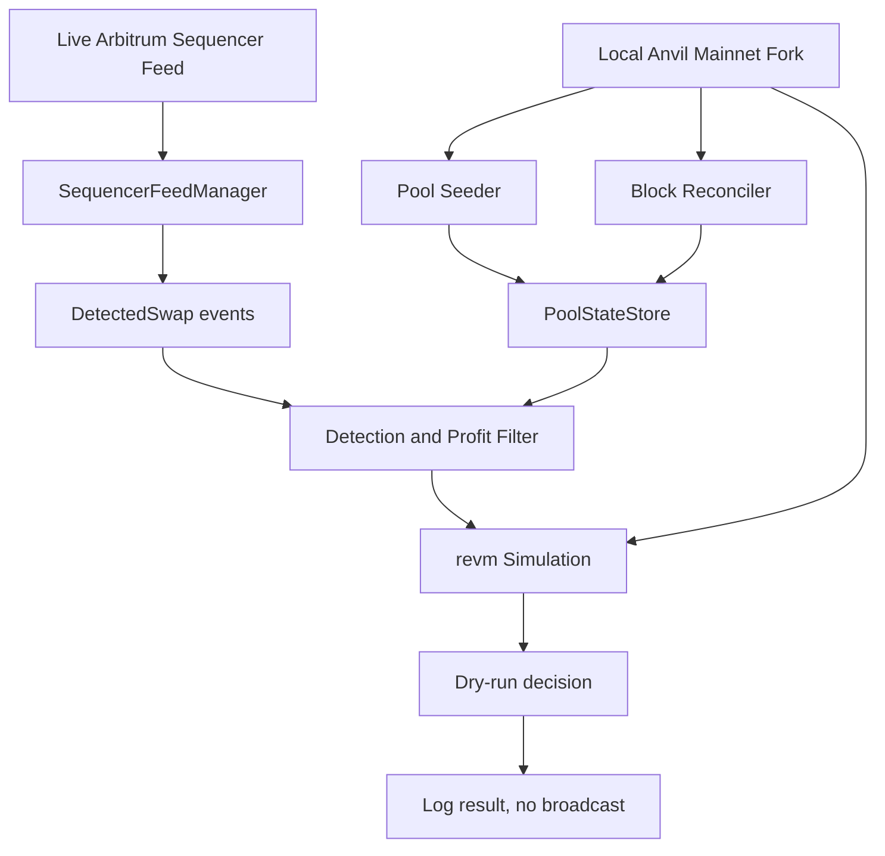

# Anvil Fork Validation

## Overview

This runbook describes the Phase 9.2 validation path, running the full bot against a local Anvil fork of Arbitrum mainnet with `dry_run = true`.

The goal is simple. Use real pool contracts, real reserve state, and the live Arbitrum sequencer feed, but avoid spending real money. That makes this the closest safe approximation to mainnet behavior before a live run.

The fork validates three things at once:

1. The bot can seed and reconcile real pool state.
2. The live detection pipeline can react to swap activity.
3. The simulator and execution path can run end to end in dry-run mode.

## Architecture



## Prerequisites

| Requirement | How to verify |
|---|---|
| Foundry installed | `anvil --version && cast --version` |
| Mainnet RPC URL configured | `ARBITRUM_RPC_URL` present in `.env` |
| Executor address configured | `ARB_EXECUTOR_ADDRESS` present in `.env` |
| Test key configured | `PRIVATE_KEY` present in `.env` |
| Binary built successfully | `cargo build --release --bin arbx` |

The private key used here does not need real funds because the run stays in dry-run mode.

## Running the Validation

### 1. Make sure the helper scripts are executable

```bash
chmod +x scripts/run_anvil_fork.sh scripts/anvil_smoke_test.sh
```

### 2. Start the fork run

In terminal one:

```bash
./scripts/run_anvil_fork.sh
```

This script starts a local Anvil fork, boots `arbx` against `config/anvil_fork.toml`, and injects a synthetic direct pool swap so the detection path is guaranteed to fire.

### 3. Check the metrics

In terminal two:

```bash
./scripts/anvil_smoke_test.sh
```

### 4. Optional overrides

```bash
FORK_BLOCK_NUMBER=106000000 ./scripts/run_anvil_fork.sh
RUN_DURATION=1200 ./scripts/run_anvil_fork.sh
./scripts/anvil_smoke_test.sh --url http://localhost:19090
```

## What to Look for in Logs

Check the active fork log file:

```bash
tail -f logs/anvil_fork_*.log
```

| Log pattern | Meaning |
|---|---|
| `PoolStateStore bootstrapped` | Factory scan completed and initial pools were seeded |
| `sequencer feed connected` | Feed handshake succeeded |
| `scanning ... candidate two-hop path(s)` | Detection loop is evaluating real candidate routes |
| `opportunity cleared profit threshold` | Raw route economics cleared the threshold gate |
| `simulation succeeded` | The full path survived revm simulation |
| `DRY RUN` | A route would have been submitted, but broadcast was intentionally skipped |
| `simulation failed` | A route was checked and rejected by the simulator |

The strongest signal in this phase is `simulation succeeded`. That proves the live detection path and the local fork simulator agree on a profitable route at that moment in state.

## Definition of Done

The Phase 9.2 fork validation is considered complete when at least one of these is true during a ten-minute run:

| Signal | Where to check |
|---|---|
| `simulation succeeded` appears in logs | `logs/anvil_fork_*.log` |
| `opportunities_cleared_simulation` becomes non-zero | `./scripts/anvil_smoke_test.sh` |

If neither happens, that does not automatically mean the bot is broken. It can simply mean there was no profitable opportunity at the chosen fork block during the observation window.

## Triage When Simulation Count Stays at Zero

Work through these checks in order.

### 1. Confirm the pool store seeded correctly

```bash
grep 'bootstrapped\|seeded' logs/anvil_fork_*.log
```

You want to see a non-zero seed count.

If the count is zero, widen the historical factory-scan window by lowering `seed_from_block` in `config/anvil_fork.toml`.

### 2. Confirm swap activity is reaching the detector

```bash
grep 'scanning\|DetectedSwap\|swap.*sel\|detected' logs/anvil_fork_*.log | head -20
```

If this stays quiet, inspect feed connectivity logs for reconnects or feed errors.

### 3. Confirm paths are actually being built

```bash
grep 'two-hop\|candidate path\|no two-hop' logs/anvil_fork_*.log | head -10
```

If you mostly see `no two-hop paths for pool`, the relevant pools may not be present in the store yet. Give the feed-first discovery and reconciler more time.

### 4. Confirm the profit threshold is not too strict

Relevant settings in `config/anvil_fork.toml`:

```toml
min_profit_floor_usd = 0.01
max_gas_gwei = 0.5
```

If the chosen fork block has expensive gas conditions, try lowering the floor further and temporarily raising the maximum gas cap so more candidates reach simulation.

### 5. Remember that the fork can be stale relative to the live feed

The feed delivers current mainnet swap ordering, but simulation still runs against the selected fork state. If a pool changed materially after that fork point, simulation may reject routes that look promising from the live event stream.

That is a valid outcome. It means the simulator is being conservative, which is exactly what you want before real-money submission.

## Moving from Fork Validation to Mainnet

Once fork validation is satisfactory:

1. Keep the fork runbook as a regression tool.
2. Switch to `config/mainnet.toml` for real operation.
3. Verify the deployed executor address is correct on Arbitrum mainnet.
4. Fund the wallet with a small gas budget only.
5. Use the explicit confirmation flow in `scripts/run-mainnet.sh`.
6. Monitor `pnl_report.sh`, logs, and Prometheus metrics throughout the run.

For the live launch checklist, continue with `docs/MAINNET_LAUNCH.md`.

## Files Used in This Phase

| File | Purpose |
|---|---|
| `config/anvil_fork.toml` | Config for the local fork run |
| `scripts/run_anvil_fork.sh` | Starts the fork and launches the bot |
| `scripts/anvil_smoke_test.sh` | Checks metrics during the run |
| `docs/ANVIL_FORK_VALIDATION.md` | This operational runbook |
