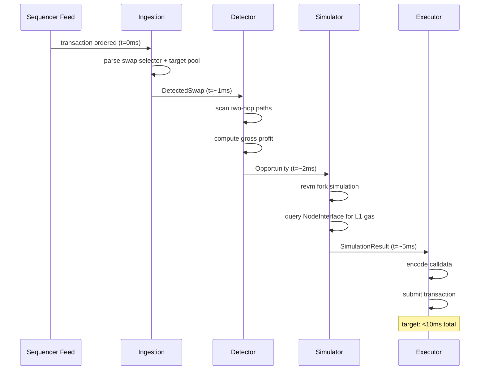
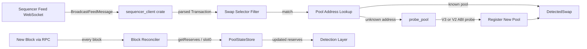
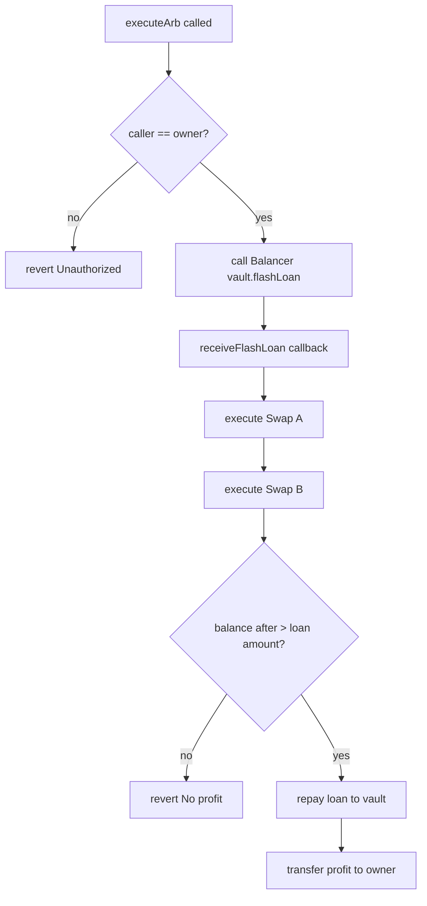
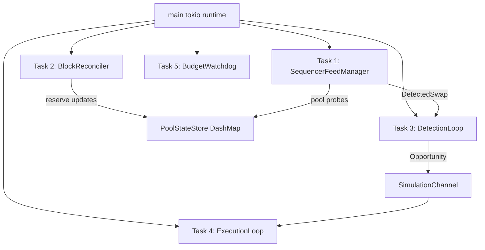

# arbx Architecture

## Overview

`arbx` is a three-layer arbitrage system for Arbitrum. It ingests live transaction ordering data and on-chain reserve updates, converts those into candidate two-hop opportunities, simulates the full trade against forked chain state, and only submits if the route is still profitable after real gas costs. The design favors correctness first, then latency, because a fast losing bot is still a losing bot.



## Layer 1: Ingestion

Layer 1 is responsible for keeping the bot's view of the market as fresh as possible.

### Sequencer feed architecture

The ingestion layer connects to the Arbitrum sequencer feed over WebSocket and uses the `sequencer_client` crate to parse feed messages into transaction-like objects. This avoids writing a custom parser for compressed batch formats and Arbitrum-specific message structures.

The feed listener looks at each transaction and asks three questions:

1. Does the transaction target a known pool address?
2. Does the calldata begin with a known swap selector?
3. If the address is unknown but the selector looks like a swap, should the bot probe the address on-chain and register it as a new pool?

If the answers line up, the feed path emits a `DetectedSwap` event into the rest of the runtime.

### Why the feed only shows top-level transactions

The live Arbitrum sequencer feed shows the top-level call in a transaction's call stack. It does not show internal calls that happen deeper inside a router transaction.

That matters because many user swaps are routed like this:

1. User calls a router contract.
2. Router contract calls a pool internally.
3. The pool swap is the economically important action.
4. The feed only exposes the router call.

This means the feed is fast, but incomplete for pure pool-level detection. It is best treated as an early warning signal, not as the only source of truth.

### Two ingestion paths

`arbx` uses two complementary ingestion paths.

1. **Sequencer feed**
   - lowest latency
   - good for early detection
   - sees top-level transactions only
   - can auto-discover new pools with `probe_pool`

2. **Block reconciler**
   - authoritative reserve refresh path
   - runs every block via RPC
   - catches updates the feed path can miss
   - keeps the in-memory pool store honest

Together, these paths provide both speed and correctness.

### Why DashMap was chosen

Pool state lives in `PoolStateStore`, which wraps `Arc<DashMap<Address, PoolState>>`.

This was chosen over `Arc<Mutex<HashMap<...>>>` for a simple reason. A global mutex becomes a bottleneck when many tasks need to read pool state at the same time. `DashMap` uses sharded locking internally, so reads and writes can proceed with much less contention. That is a better fit for a low-latency, multi-task pipeline.



## Layer 2: Detection and Simulation

Layer 2 decides whether a newly changed market state is interesting enough to pursue.

### Two-hop path structure

The initial strategy uses two-hop circular paths. A simple example is:

`USDC -> UniswapV3 -> ETH -> Camelot -> USDC`

The bot starts with one token, trades into a middle token through pool A, then trades back into the original token through pool B. If the final amount of the original token is greater than the starting amount, there may be an arbitrage.

This structure is easier to reason about than longer routes and keeps the simulation surface smaller.

### Profit formula

The core formula is:

```text
gross_profit = output_amount - input_amount
flash_loan_fee = 0 (Balancer V2)
gas_cost = L2 execution gas + L1 calldata gas
net_profit = gross_profit - gas_cost
```

The zero flash-loan fee is not a detail. It changes the math materially for small opportunities.

### Arbitrum's 2D gas model

This is the most important implementation detail for anyone building on Arbitrum.

A normal `eth_estimateGas` call tells you how much Layer 2 execution gas a transaction is expected to use. That is only part of the true cost.

Arbitrum transactions also pay for the cost of posting their calldata back to Ethereum mainnet for data availability. This is the **L1 calldata cost**. It can move sharply when Ethereum mainnet becomes congested.

So, if you only look at `eth_estimateGas`, you can think a trade costs a few cents when the real total cost is much higher.

`arbx` corrects this by querying Arbitrum's `NodeInterface` precompile at `0x00000000000000000000000000000000000000C8` before deciding whether a candidate still clears the profit threshold.

The true cost model is:

```text
l2_gas_cost = eth_estimateGas() * l2_gas_price
l1_gas_cost = gasEstimateL1Component() * l1_base_fee
total_gas_cost = l2_gas_cost + l1_gas_cost
net_profit = gross_profit - total_gas_cost
```

This prevents one of the most common Arbitrum mistakes, treating execution gas as if it were the full transaction cost.

### revm fork simulation

Before any live submission, the candidate trade is simulated with `revm` against a forked view of chain state.

In practice, that means:

1. The simulator points at an RPC-backed snapshot of Arbitrum state.
2. It encodes the exact contract call that would be submitted on-chain.
3. It runs the flash-loan callback path, swap logic, and repayment path locally.
4. It checks whether the final result is still profitable.

A forked state is just a local view of the real chain at a chosen point in time. It lets the bot test a transaction as if it were about to land, without actually broadcasting it.

This step matters because a candidate that looks profitable from raw reserve math can still fail once the full contract path, gas usage, or price movement is taken into account.

## Layer 3: Execution

Layer 3 turns a simulated opportunity into an on-chain transaction.

### ArbExecutor.sol architecture

The contract implements Balancer V2's `IFlashLoanRecipient` interface. That means the contract does not just request a loan, it must also correctly handle Balancer's callback flow.

The high-level execution path is:

1. The bot calls `executeArb` as the contract owner.
2. The contract asks the Balancer V2 vault for a flash loan.
3. Balancer sends the funds and calls `receiveFlashLoan`.
4. The contract performs swap A and swap B.
5. The contract checks that the ending balance exceeds the required repayment and minimum profit.
6. It repays the loan.
7. It sends remaining profit to the owner.

### Four DEX swap paths

The contract supports four swap families.

- **Uniswap V3** uses concentrated liquidity and callback-based swap semantics. The pool expects the caller to settle the owed token in the swap callback.
- **Camelot V2** uses V2-style reserve math and direct `swap(amount0Out, amount1Out, to, data)` behavior.
- **SushiSwap** also uses V2-style semantics.
- **Trader Joe V1** also uses V2-style semantics.

So, from the contract's perspective, there are really two swap models to support:

1. **V3 model**, callback-driven and tick-based.
2. **V2 model**, reserve-based and direct-output oriented.

### Profit guard and atomic revert

The contract has an explicit `require`-style profit check before repayment completes. If the ending balance is not high enough, the transaction reverts.

That means the trade is atomic. Either the full profitable route completes, or none of it counts. There is no partial success that leaves the bot holding inventory.



## Pool State Management

`PoolStateStore` is a thin wrapper around a shared `DashMap`.

### Clone semantics

Cloning a `PoolStateStore` does **not** duplicate the data. Each clone points to the same backing map through an `Arc`. That is important because different tasks, feed handling, reconciliation, detection, and local fork polling, all need to operate on the same live state.

### Core operations

- `upsert`: insert a new pool or replace an existing snapshot entirely
- `update_reserves`: update reserves and block height for a known pool
- `by_dex`: filter pools by exchange type
- `pools_containing_token`: retrieve candidate pools for route discovery
- `get`: clone out a snapshot for further processing

### Why both feed and reconciliation are needed

Feed-driven updates are fast but incomplete. Reconciliation is slower but authoritative. Using both prevents the system from drifting too far from actual chain state while still reacting quickly to fresh events.

## Concurrency Model

The runtime is built around a supervised Tokio task graph.



### Channel types

The main runtime uses Tokio `mpsc` channels.

- `mpsc::channel<DetectedSwap>(1024)` connects ingestion to detection.
- `mpsc::channel<Opportunity>(256)` connects detection to execution.

These were chosen because the pipeline is one-directional and backpressure matters. A bounded channel forces the runtime to surface overload instead of silently growing memory use forever.

### Task supervision

The main runtime spawns the following long-lived tasks:

1. Sequencer feed manager
2. Block reconciler
3. Detection loop
4. Execution loop
5. Budget watchdog
6. Block poller, only on local Anvil fork runs

The top-level `run()` function waits on all of them with `tokio::select!`. If any critical task exits, or if the process receives `SIGINT` or `SIGTERM`, the runtime begins graceful shutdown.

### What happens when a task panics or exits unexpectedly

Any unexpected task exit is treated as a system-level problem. The runtime:

1. records the shutdown reason
2. aborts the remaining task handles
3. persists PnL state to disk
4. exits instead of pretending the system is still healthy

This is safer than letting the bot keep running with a broken ingestion or execution path.

## Config System

Configuration lives in TOML files under `config/`, but sensitive values are passed through environment variables.

Example:

```toml
[network]
rpc_url = "${ARBITRUM_RPC_URL}"

[execution]
contract_address = "${ARB_EXECUTOR_ADDRESS}"
private_key = "${PRIVATE_KEY}"
```

At load time, the config system scans for `${VAR}` patterns and replaces them with current environment values. If a required variable is missing, config loading fails immediately with a clear error.

Private keys are never stored directly in tracked TOML files because that would be too easy to commit by mistake. Keeping them in `.env` or another local secret store reduces that risk.

## Observability

`arbx` exposes Prometheus metrics so operators can see where opportunities are being lost.

### Metrics

| Metric | Type | Measures |
|---|---|---|
| `opportunities_detected` | `IntCounter` | Candidate paths found after a detected swap |
| `opportunities_cleared_threshold` | `IntCounter` | Candidates that still clear the profit threshold |
| `opportunities_cleared_simulation` | `IntCounter` | Candidates that survive full revm simulation |
| `transactions_submitted` | `IntCounter` | Live transactions sent on-chain |
| `transactions_succeeded` | `IntCounter` | Successful on-chain arbitrage transactions |
| `transactions_reverted{reason=...}` | `IntCounterVec` | Reverted submissions grouped by reason |
| `net_pnl_wei` | `Gauge` | Current signed net PnL |
| `gas_spent_wei` | `Counter` | Total gas spent over time |

### Funnel model

The healthy path is:

```text
opportunities_detected
  -> cleared_threshold
    -> cleared_simulation
      -> submitted
        -> succeeded
```

A healthy funnel usually looks like this:

- detections are frequent enough to matter
- a smaller subset clears the threshold
- a smaller subset clears simulation
- most submitted trades succeed or fail for understandable reasons

Warning signs include:

- **High detected, low threshold clears**: gas is too expensive or the floor is too strict.
- **High threshold clears, low simulation clears**: reserve model is stale or route math is incomplete.
- **High simulation clears, high revert rate**: the bot is being raced or submitting too slowly.
- **Low revert rate, negative PnL**: winners are too small to overcome gas.

That funnel view is one of the most useful debugging tools in the whole system.
